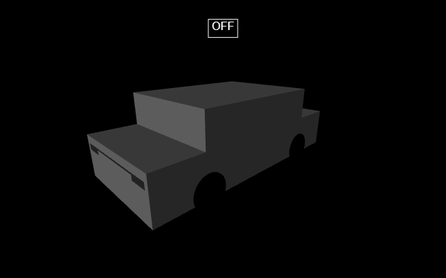
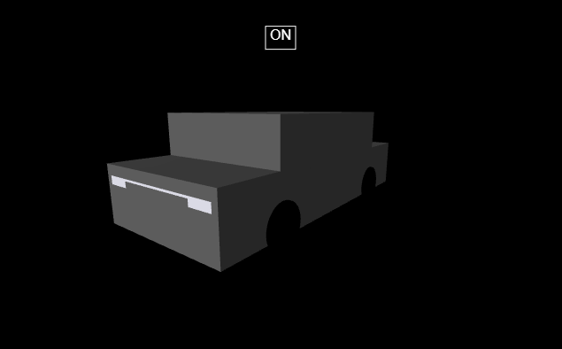
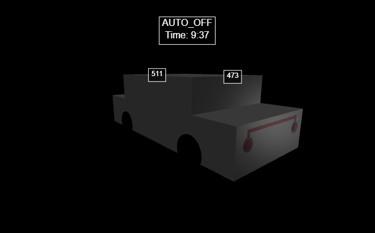
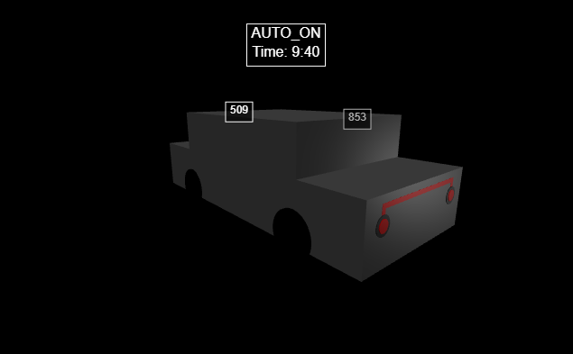
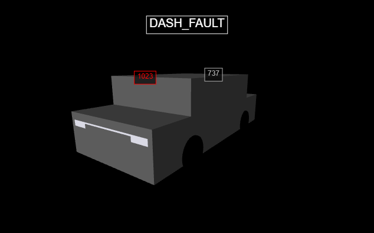
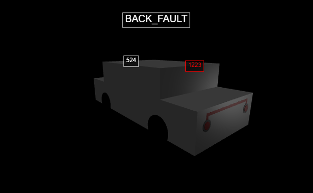
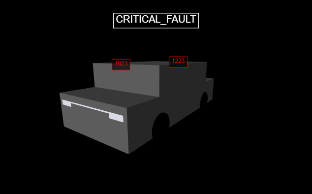

# Automotive Light Controller

**Author:** Toni Matutinović  
**Hardware:** Arduino Uno R3, RTC DS3231, Dual LDR Sensors, Potentiometer, RGB LED (status indicator), Yellow LED (headlight output)  
**Technologies:** Arduino C++, Python 3, VPython  
**Description:**  
Automatic vehicle light control system with three operating modes:  

- **OFF**  : Manual override, lights disabled  
- **AUTO** : Automatic headlights using ambient light + RTC time + tunnel logic  
- **ON**   : Manual override, headlights forced on  

The system detects LDR sensor faults, provides visual feedback via RGB LED, and visualizes lights and sensor status in real time using VPython.

---

## Features

- Manual modes: **OFF**, **ON**  
- Automatic mode (**AUTO**) based on ambient light + RTC time  
- **Tunnel logic / Debouncing:** lights only turn on if darkness persists > 2 seconds  
- Dual-LDR ambient light sensing with noise filtering  
- Headlight output via yellow LED  
- RGB LED status indicator (mode, error, transitions)  
- Sensor fault detection: dash LDR, back LDR, and critical fault  
- Sends system data via Serial for VPython visualization  
- Real-time VPython 3D car visualization with LDR readings and status labels
- Calculates sunrise and sunset times for Split, Croatia, for the current date to determine day/night
- Optional simulated time for testing  

---

## Wiring Diagram

  
*Shows connections of Arduino Uno to dual LDRs, potentiometer, RGB LED, yellow headlight LED, and RTC.*

---

## VPython 3D Visualization

### Modes

**OFF Mode**  
  
*Lights are off; RGB LED weak white; status label shows OFF.*  

**ON Mode**  
  
*Lights forced on; RGB LED green; status label shows ON.*  

**AUTO Mode**  

**AUTO_OFF**  
  
*Ambient light high; lights remain off.*  

**AUTO_ON**  
  
*Lights automatically turn on only if darkness persists more than 2 seconds, simulating tunnels or prolonged shadows. Short shadows or passing under bridges do not trigger the lights.*  

---

## Fault Detection

**Dash LDR Fault**  
  
*Dash sensor inactive, error displayed.* 

  
*Dash sensor inactive, system works based on back LDR.*  

**Back LDR Fault**  
  
*Back sensor inactive, system works based on dash LDR, error displayed.*  

**Critical Fault**  
  
*Both sensors fail, lights turn on for safety, error label displayed.*  

---

## Demo Videos

*Videos coming soon.*  

---

## Folder Structure
```
automotive-light-controller/
├─ code/
│ ├─ arduino/
│ │ └─ automotive-light-controller/
│ │   └─ automotive-light-controller.ino
│ └─ python/
│   └─ automotive_lights_sim.py
├─ docs/
│ └─ wiring-diagram.png
├─ images/
│ ├─ OFF-mode.png
│ ├─ ON-mode.png
│ ├─ AUTO_OFF.png
│ ├─ AUTO_ON.png
│ ├─ dash-fault.png
│ ├─ dash-fault-working.png
│ ├─ back-fault.png
│ └─ critical-fault.png
├─ videos/
└─ README.md
```
---

## How to Run

1. Upload `automotive-light-controller.ino` to Arduino Uno  
2. Connect dual LDRs, potentiometer, RGB LED, yellow headlight LED, and RTC according to wiring diagram  
3. Open Python script `automotive_lights_sim.py` to see 3D real-time visualization  
4. Adjust potentiometer to select **OFF**, **AUTO**, or **ON** mode  
5. Observe RGB LED color changes, LDR readings, and status labels  
6. Lights automatically follow tunnel logic in AUTO mode and respond to sensor faults  
